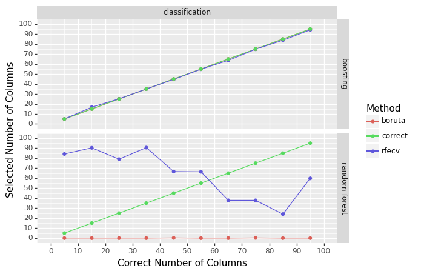

## Repo Overview

For machine learning problems, a standard question is how to pick
features. Many methods have been proposed. This repo compares recursive
feature elimination to boruta. Both methods are resampling based.

- Does the method find the correct number of features?
- Do results depend on model used?
- Do results depend on problem? Regression vs Classification.

The main result is recursive feature elimination is the method I would
use if I had to pick just one. Both methods work well, but boruta takes
**much** longer to compute. Depending on time constraints or scale of
data, this could be a major issue.

Switching between methods requires one line of code change. If compute
speed is not an issue or if a python session can run over night, trying
both methods takes almost no time to code.

## Simulation Setup

Basic outline: - Step 1: Create data. - Step 2: Select a model. Random
forest or extra trees. - Step 3: Record the number of features selected
by recursive feature elimination. - Step 4: Record the number of
features selected by boruta.

The correct number of features is varied. Each combination of settings
is repeated 5 times and an average is computed to reduce variability.
Model hyper parameters are left at default values. Feature selection
hyper parameters are left at default values as well.

The first few iteration look like

               model        dataType  col  b  rfecv  boruta
    0  random forest  classification    5  0     75       0
    1  random forest  classification    5  1     83       0
    2  random forest  classification    5  2     77       0
    3  random forest  classification    5  3     95       0
    4  random forest  classification    5  4     91       0

## Results

In the below graph, each feature selection method is a color. The
correct answer (in green) is provided for reference. The closer the
other colors are to green, the better.

    <ggplot: (127993152765)>

There are two extremes between boosting and random forest that lead to
performance differences in feature selection. The boosting model had a
very high training accuracy. This caused both feature selection methods
to produce the correct features in all cases. Interestingly, the
boosting approach overfit. Training accuracy was high and test accuracy
was very low. This shows both feature selection methods are robust
against an overfitting base estimator.

The random forest model did not overfit. Instead, it did no better than
using the most common class in training data. Both feature selection
methods failed to select the correct number of variables. Boruta has the
advantage of always selecting zero variables which is correct in that no
feature is predictive for the random forest model. Recursive feature
elimination did noticeably worse. As the correct number of features
increases, the number of features selected decreases.

Both methods are resilient to overfitting. Boruta is a bit better in
that it returned zero when no features are predictive for the base
estimator. However, boruta takes about 3.5 times longer to compute.
Feature selection should not be a way of detecting lack of predictive
performance. There are better ways of doing this. So boruta’s long
compute time out weights its better performance for the edge case of
poor performance in the base estimator. At least in my opinion.

## Technical Considerations

Ideally, the feature selection method works with any model.
Unfortunately, both methods limit the type of models. Recursive feature
elimination requires the base estimator to have either coef\_ or
feature_importance\_ attributes. Boruta requires the base estimator to
have the feature_importance\_ attribute. Many estimators don’t have
these attributes.

Compute time is another major consideration. For regression, this
simulation was on track for over 20 days of compute time. That is with
only fifty thousand data points and using LightGPM’s GPU training on a
4070 TI.
